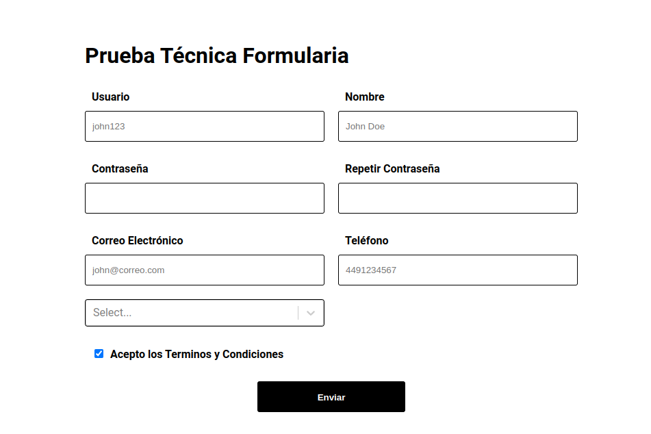

# prueva tecnica formulario 

Prueba técnica de formulario , la prueba fue realizada con los parámetros solicitados  , la base de datos usada es mongo dB,  el Font-end fue realizado en React js  en su última versión   





# backend
url de el servidor en linea [https://prueva.fly.dev/users](https://prueva.fly.dev/users).

url  de el codigo [https://github.com/elmanci2/backend__mongo__whiteSoft.git](https://github.com/elmanci2/backend__mongo__whiteSoft.git).

# uso

```bash
npm run dev 
```

Para ver los datos almacenados  realice una petición get a  => [https://prueva.fly.dev/users]() 

Para mandar los datos almacenados  realice una petición post a =>[https://prueva.fly.dev/users]() 


# Front

prueva en vivo => [https://elmanci2.github.io/form-technical-test/]()

ver codigo => [https://github.com/elmanci2/code_prueva_tecnica_form.git]()


# uso 

<p> clone el repositorio </p>

```bash
npm run dev 
```

<p> ejecute  </p>

```bash
npm i 
```
### `npm start`


